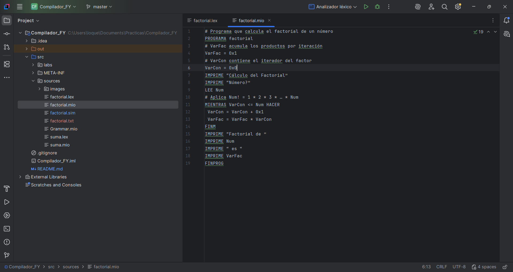
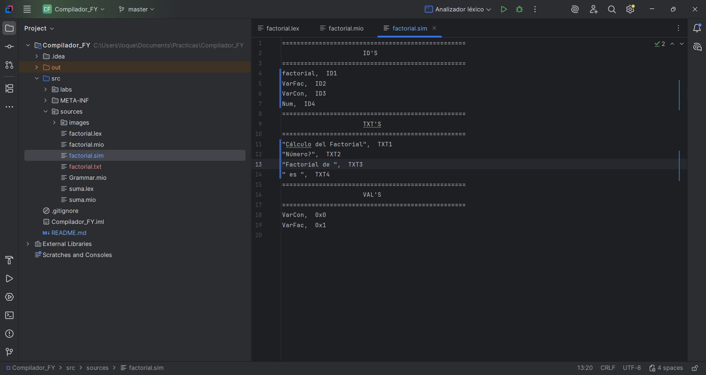
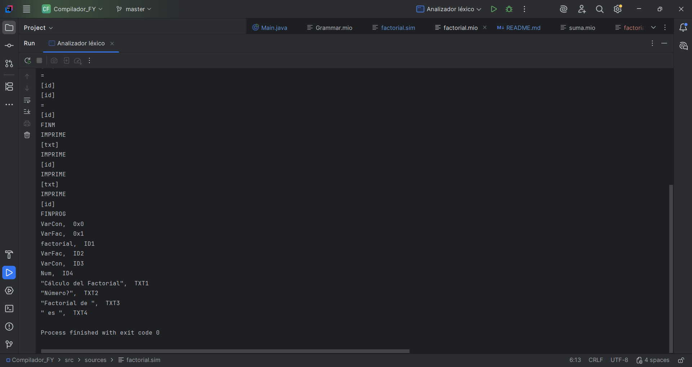
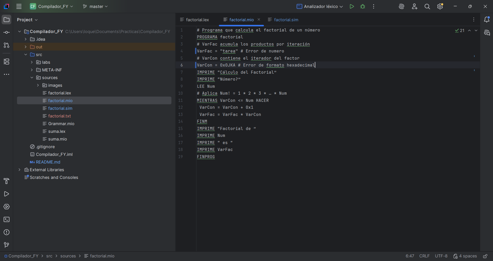
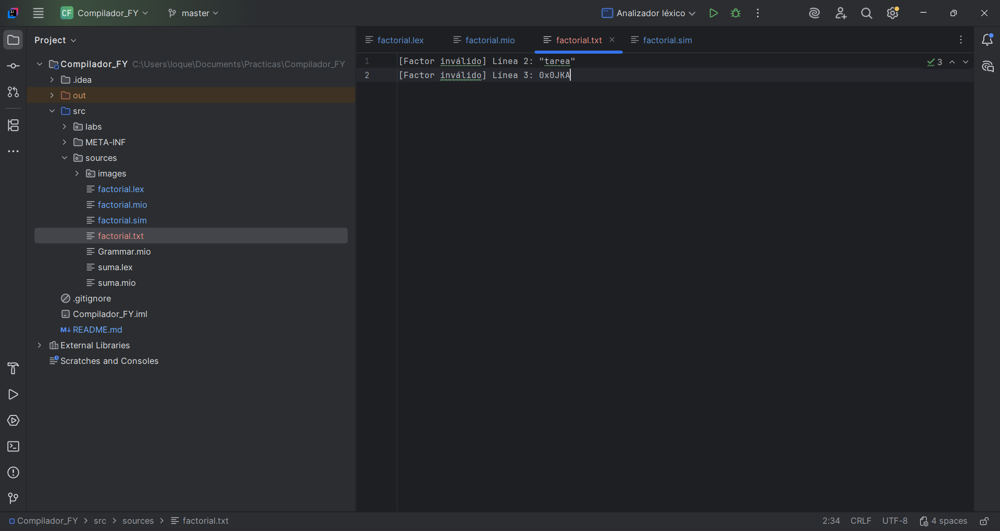
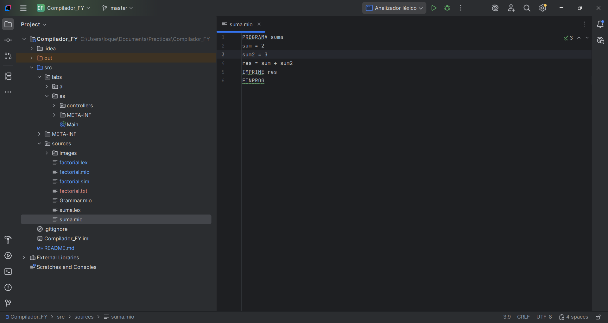
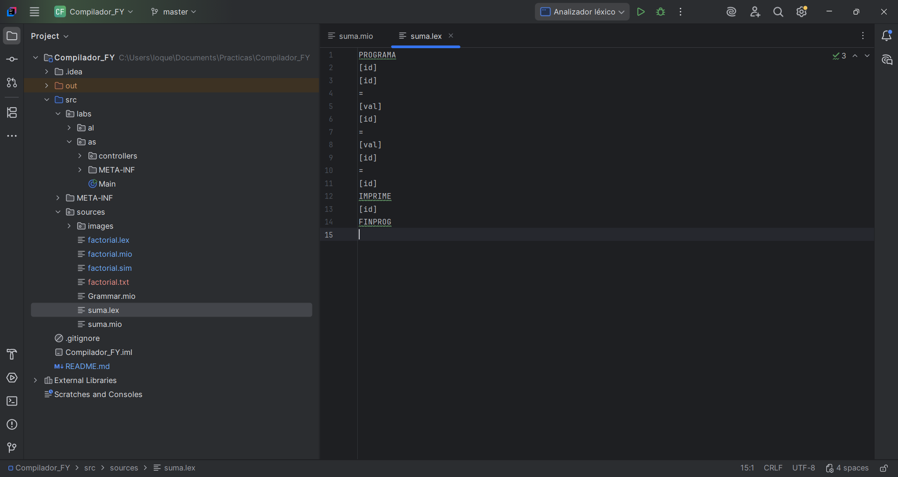
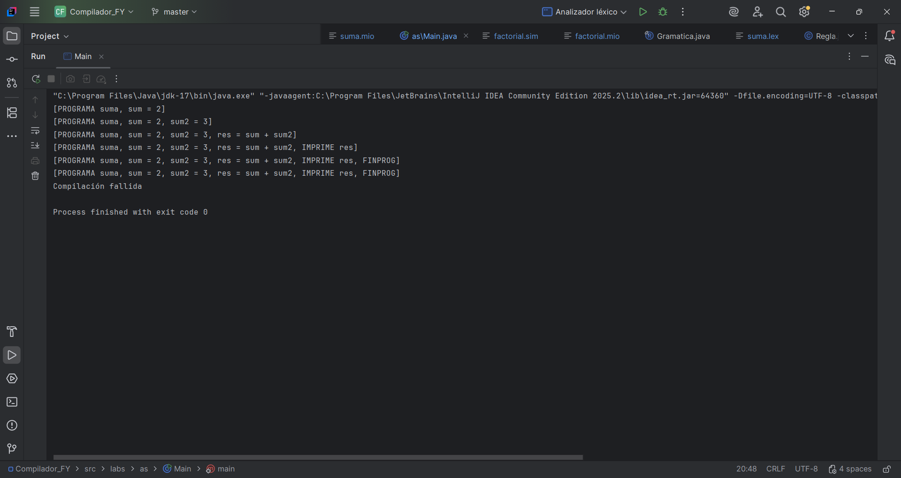

# Compilador

**Integrantes: Gioser Andre Dzib Chan, Emmanuel Adrian Flores Noh**

**Curso: Teoria de la computación**

El objetivo es implementar un compilador para un lenguaje de programación básico llamado MIO, que soporta estructuras de control, operaciones aritméticas, variables y números hexadecimales. El proceso de compilación se divide en dos fases principales:

### Análisis Léxico

Identifica y valida las unidades léxicas (tokens) del código fuente. Genera dos salidas:

- Una secuencia de tokens en formato de texto
- Una tabla de símbolos que registra identificadores, literales numéricas y literales de texto

Reporta errores léxicos indicando la línea exacta donde se encuentran.

### Análisis Sintáctico

Verifica que la secuencia de tokens corresponda a estructuras gramaticales válidas del lenguaje. Reporta si la compilación fue exitosa o indica los errores sintácticos encontrados.

---

## Especificación del Analizador Léxico

### Funcionamiento

El analizador léxico lee el archivo fuente `programa.mio` e identifica cada unidad léxica. Cuando detecta un token inválido, genera un mensaje de error con el número de línea correspondiente.

Los tokens identificados se escriben en `programa.lex` (un token por línea), mientras que la tabla de símbolos se guarda en `programa.sim`.

## Elementos Léxicos del Lenguaje MIO

> Comentarios
>
>
> Las líneas que inician con '#' se consideran comentarios y son ignoradas durante el análisis.
>

### Tokens del Lenguaje

| Palabras reservadas | Operadores Relacionales | Operadores Aritméticos |
| --- | --- | --- |
| PROGRAMA | Mayor que (>) | Suma (+) |
| FINPROG | Menor que (<) | Resta (-) |
| SI | Igual a (==) | Multiplicación (*) |
| ENTONCES | Mayor o igual (>=) | División (/) |
| SINO | Menor o igual (<=) |  |
| FINSI | Diferente (<>) |  |
| MIENTRAS | Asignación (=) |  |
| HACER |  |  |
| FINM |  |  |
| IMPRIME |  |  |
| LEE |  |  |

### Identificadores

Nombres de variables y programas con las siguientes características:

- Longitud máxima: 16 caracteres
- Deben iniciar con una letra (a-z, A-Z)
- Pueden contener letras y números
- Son sensibles a mayúsculas y minúsculas

**Ejemplos:** `DiaDeLaSemana1`, `variable03`, `X2`

### Literales de Texto

Cadenas de caracteres encerradas entre comillas dobles. No tienen restricción de longitud.

**Ejemplo:** `"caracteresalf4num3ric05"`

### Literales Numéricas

Números en base hexadecimal que deben cumplir:

- Iniciar con el prefijo `0x` (cero y x minúscula)
- Contener dígitos del 0 al 9 y letras de la A a la F

**Ejemplo:** `0x1A3F`, `0xFF`

## Tabla de Símbolos

La tabla de símbolos se organiza en tres secciones independientes, cada una almacenada en orden de aparición:

### 1. Sección de Identificadores (IDS)

- **Columna 1:** Nombre del identificador
- **Columna 2:** Clave consecutiva (ID01, ID02, ID03...)

### 2. Sección de Literales de Texto (TXT)

- **Columna 1:** Contenido del texto literal (con comillas)
- **Columna 2:** Clave consecutiva (TX01, TX02, TX03...)

### 3. Sección de Literales Numéricas (VAL)

- **Columna 1:** Valor en representación hexadecimal
- **Columna 2:** Valor equivalente en decimal

Las tres secciones se escriben en el archivo `programa.sim` en el orden especificado.

---

## Especificación del Analizador Sintáctico

### Funcionamiento

El analizador sintáctico valida que la estructura del programa sea correcta según las reglas gramaticales del lenguaje MIO. Trabaja sobre el archivo de tokens que generó previamente el analizador léxico.

Utiliza un enfoque de análisis descendente recursivo, donde cada regla gramatical se valida mediante un método específico:

- Un método valida que el programa inicie correctamente con PROGRAMA, seguido del nombre, las sentencias y FINPROG
- Otro método procesa múltiples sentencias consecutivamente
- Existe un método que identifica el tipo de sentencia (asignación, condicional, ciclo, etc.) y delega su validación
- Hay métodos especializados para validar expresiones aritméticas, factores y comparaciones

El analizador mantiene un puntero que recorre la lista de tokens. Va consumiendo los tokens esperados y avanzando el puntero. Si encuentra un token inesperado, detecta un error sintáctico.

### Resultados de la Compilación

Al finalizar, el programa muestra uno de dos resultados:

- **Éxito:** Muestra "Compilación exitosa" cuando todo el código es sintácticamente correcto
- **Error:** Indica el tipo específico de error encontrado (asignación, condicional, ciclo, impresión, lectura, expresión o comparación)

Opcionalmente, puede registrar todos los errores en una lista y mostrarlos al final, permitiendo al desarrollador ver múltiples problemas de una vez.

---

## Formatos

### Gramática

```java
<PROG> → PROGRAMA [id] <SENTS> FINPROG
<SENTS> → <SENT> <SENTS>
<SENTS> → <SENT>
<SENT> → [id] = <EXPR>
<SENT> → SI <COMPARA> ENTONCES <SENTS> SINO <SENTS> FINSI
<SENT> → SI <COMPARA> ENTONCES <SENTS> FINSI
<SENT> → MIENTRAS <COMPARA> HACER <SENTS> FINM
<SENT> → IMPRIME <EXPR>
<SENT> → IMPRIME [txt]
<SENT> → LEE [id]
<SENT> → # [comentario]
<EXPR> → <FAC> [op_ar] <FAC>|<FAC>
<FAC> → [id]
<FAC> → [val]
<COMPARA> → [id] [op_rel] <EXPR>
```

### Formato de salida para archivos

Basado en el ejemplo dado del archivo.mio con el siguiente programa, debera crear dos archivos más, uno con el código fuente, otro con la tabla de simbolos

```
# Programa que calcula el factorial de un número
PROGRAMA factorial
# VarFac acumula los productos por iteración
VarFac = 0x1
# VarCon contiene el iterador del factor
VarCon = 0x0
IMPRIME “Cálculo del Factorial”
IMPRIME “Número?”
LEE Num
# Aplica Num! = 1 * 2 * 3 * … * Num
MIENTRAS VarCon <= Num HACER
 VarCon = VarCon + 0x1
 VarFac = VarFac * VarCon
FINM
IMPRIME “Factorial de ”
IMPRIME Num
IMPRIME “ es “
IMPRIME VarFac
FINPROG
```

### Formato de salida para achivo.lex

```
PROGRAMA
[id]
[id]
=
[val]
[id]
=
[val]
IMPRIME
[txt]
IMPRIME
[txt]
LEE
[id]
MIENTRAS
[id]
[op_rel]
HACER
[id]
=
[id]
[id]
=
[id]
FINM
IMPRIME
[txt]
IMPRIME
[id]
IMPRIME
[txt]
IMPRIME
[id]
FINPROG
```

### Formato de salida para achivo.sim

```
factorial,  ID1
VarFac,  ID2
VarCon,  ID3
Num,  ID4
"Cálculo del Factorial",  TXT1
"Número?",  TXT2
"Factorial de ",  TXT3
" es ",  TXT4
VarCon,  0x0
VarFac,  0x1
```

---

# Descripción de proceso

## Analizador Léxico

### Descripción General

El analizador léxico es el componente encargado de procesar el código fuente contenido en archivos con extensión `.mio`. Su función principal es identificar y clasificar cada unidad léxica (token) presente en el código, además de construir una tabla de símbolos completa que registra todas las variables numéricas junto con sus valores hexadecimales, los textos literales utilizados en el programa, y los identificadores declarados.

La implementación del analizador léxico se encuentra principalmente en la clase `Conversor`, que contiene los siguientes atributos de instancia relevantes:

- `TablaSimbolo simbolos`: Instancia que encapsula la tabla de símbolos del programa. Esta estructura de datos mantiene tres colecciones MAP separadas internamente para almacenar identificadores, valores hexadecimales asociados a variables, y textos literales.
- `List&lt;ErrorCompilacion&gt; errores`: Lista que acumula todos los errores detectados durante el análisis léxico. Cada elemento es un objeto `ErrorCompilacion` que contiene el código del error, un mensaje descriptivo, y el número de línea donde ocurrió.
- `List&lt;String&gt; lex`: Lista que almacena la secuencia de tokens identificados en el código fuente. Los tokens se representan en forma de cadenas de texto, utilizando notación especial entre corchetes para tokens abstractos (por ejemplo, `[id]` para identificadores, `[val]` para valores hexadecimales, `[txt]` para textos literales).
- `int numLinea`: Contador que lleva el registro de la línea actual que está siendo procesada. Este atributo es fundamental para asociar cada error detectado con su ubicación exacta en el código fuente, facilitando la depuración.

### Preprocesamiento del Código

Antes de iniciar el análisis léxico propiamente dicho, el código fuente pasa por una fase de preprocesamiento implementada en la clase auxiliar `Lector`. Esta clase contiene el método estático `leerCodigo(Path ruta)` que recibe como parámetro la ruta del archivo a procesar y retorna una lista de cadenas de texto, donde cada elemento representa una línea del código fuente ya limpia.

Durante este preprocesamiento se realiza la eliminación de comentarios siguiendo estas reglas:

- Las líneas que comienzan con el símbolo '#' se consideran líneas de comentario completas y se excluyen totalmente del análisis. El método detecta esto verificando si el primer carácter no vacío de la línea es '#'.
- Cuando aparece el símbolo '#' en medio de una línea de código, se interpreta como el inicio de un comentario de línea. En este caso, el método extrae únicamente la porción de texto anterior al símbolo '#', descartando el comentario y todo lo que le sigue.
- Las líneas completamente vacías o que solo contienen espacios en blanco también se filtran para evitar procesamiento innecesario.

El resultado de este preprocesamiento es una colección de líneas de código limpio, sin comentarios ni líneas vacías, que constituye la entrada para el analizador léxico.

### Proceso de Validación de Tokens

El método principal del analizador léxico es `procesar(List&lt;String&gt; lineas)` en la clase `Conversor`. Este método recibe la lista de líneas preprocesadas y las procesa secuencialmente, incrementando el atributo `numLinea` con cada iteración para mantener la correspondencia con el código fuente original.

Para cada línea de código, se invoca el método privado `tokenizar(String linea)`, que descompone la línea en tokens individuales. Este método utiliza un enfoque basado en estados y una instancia de `StringBuilder` llamada `cur` para acumular caracteres. El proceso de tokenización considera varios casos especiales:

- Los espacios en blanco actúan como separadores de tokens, pero se ignoran como tokens en sí mismos.
- Los operadores aritméticos y de asignación (`=`, `+`, `-`, `*`, `/`, `&lt;`, `&gt;`) se reconocen como tokens individuales, incluso cuando aparecen sin espacios adyacentes.
- Las comillas dobles activan un modo especial de procesamiento que se detalla en la sección de manejo de cadenas de texto.

Una vez tokenizada la línea, el método `procesarLinea(List&lt;String&gt; tokens)` analiza la secuencia resultante. Este método comienza verificando si el primer token de la lista corresponde a alguna de las palabras reservadas del lenguaje, que están definidas en el conjunto estático `PALABRAS_RESERVADAS`. Este conjunto incluye: PROGRAMA, FINPROG, LEE, IMPRIME, SI, ENTONCES, SINO, FINSI, MIENTRAS, HACER, FINM.

El análisis difiere según la palabra reservada identificada:

- Para **PROGRAMA** y **FINPROG**: Se verifica que aparezcan aisladas en su línea. Si hay tokens adicionales, se registra un error mediante el método `errores.add()` y se agrega el token correspondiente a la lista `lex`.
- Para **LEE**: Se valida que exista un segundo token y que este sea un identificador válido según el patrón regex almacenado en `IDENTIFICADORES`. Si la validación es exitosa, se invoca `simbolos.registrarID(id)` para agregar el identificador a la tabla de símbolos, y se añaden tanto "LEE" como "[id]" a la lista `lex`.
- Para **IMPRIME**: Se verifica que haya un argumento y que este sea un texto literal (validado con el regex `TEXTO`) o un identificador. Dependiendo del tipo, se registra en la tabla de símbolos mediante `simbolos.registrarTXT(arg)` o `simbolos.registrarID(arg)`.
- Para estructuras de control como **SI** y **MIENTRAS**: Se valida que la estructura tenga al menos 5 tokens (mínimo requerido para formar una estructura válida). Luego se verifica la presencia de un identificador, un operador relacional (validado contra el conjunto `OPERACIONES_REL` que contiene <, >, ==, !=, <=, >=), un factor (valor hexadecimal o identificador), y la palabra reservada correspondiente (ENTONCES o HACER).

Cuando se detecta una asignación (reconocida por la presencia del token `=` en la segunda posición), el método valida que el primer token sea un identificador válido, registra este identificador en la tabla de símbolos, y luego procesa el lado derecho de la asignación invocando el método `procesarFactor(String token, String variableActual)`.

### Validación con Expresiones Regulares

La clase `Conversor` define varios atributos estáticos de tipo `Pattern` que encapsulan expresiones regulares compiladas para validar diferentes tipos de tokens:

- `Pattern IDENTIFICADORES`: Implementa el patrón `[a-zA-Z_][a-zA-Z0-9_]*`, que define que los identificadores deben comenzar con una letra (mayúscula o minúscula) o guion bajo, seguido de cero o más caracteres alfanuméricos o guiones bajos. Este patrón se utiliza en el método privado `esIdentificador(String t)`, que además verifica que el token no pertenezca al conjunto `PALABRAS_RESERVADAS` para evitar colisiones.
- `Pattern HEXADECIMAL`: Implementa el patrón `0[xX][0-9a-fA-F]+`, que valida números hexadecimales que deben comenzar obligatoriamente con el prefijo "0x" o "0X", seguido de uno o más dígitos hexadecimales (0-9, a-f, A-F). El método `esHex(String t)` utiliza este patrón mediante `HEXADECIMAL.matcher(t).matches()`.
- `Pattern TEXTO`: Define el patrón `"[^"]*"`, que reconoce textos literales como cualquier secuencia de caracteres encerrada entre comillas dobles, excluyendo comillas dentro del texto. El método `esTextoLiteral(String t)` aplica este patrón para validar argumentos de IMPRIME.

Los operadores se clasifican utilizando dos estructuras de datos estáticas:

- `Set&lt;String&gt; OPERACIONES_REL`: Contiene los operadores relacionales permitidos: <, >, ==, !=, <=, >=. Este conjunto se utiliza para validar el segundo token en estructuras SI y MIENTRAS.
- Los operadores aritméticos (+, -, *, /) se identifican durante la tokenización pero no tienen un conjunto dedicado, ya que su validación ocurre implícitamente durante el procesamiento de expresiones.

Es importante notar la distinción entre el operador de asignación `=` (un solo símbolo igual) y el operador de igualdad lógica `==` (dos símbolos iguales consecutivos). El tokenizador maneja esta diferencia correctamente: si detecta dos caracteres `=` consecutivos sin espacios intermedios, los combina en un solo token `==`.

### Manejo de Cadenas de Texto

El procesamiento de textos literales constituye uno de los aspectos más complejos del analizador léxico debido a la necesidad de tratar las comillas como delimitadores especiales que pueden contener cualquier carácter, incluyendo aquellos que normalmente actuarían como separadores de tokens.

El método `tokenizar(String linea)` implementa un mecanismo de estados para manejar esto correctamente. Utiliza dos variables locales clave:

- `boolean enComillas`: Bandera que indica si el procesamiento actual se encuentra dentro de un texto literal. Se inicializa en `false` y se alterna cada vez que se encuentra una comilla doble.
- `StringBuilder cur`: Buffer temporal que acumula los caracteres del token actual. Se limpia cada vez que se completa un token.

El algoritmo procesa la línea carácter por carácter mediante un bucle `for`:

1. Cuando se detecta una comilla doble (`c == '"'`), el carácter se agrega a `cur` y se invierte el valor de `enComillas` mediante `enComillas = !enComillas`. Esto permite manejar tanto la comilla de apertura como la de cierre con la misma lógica.
2. Si `enComillas` es `true`, todos los caracteres subsecuentes se agregan directamente a `cur` sin ningún procesamiento especial, incluyendo espacios, operadores, y cualquier otro carácter que normalmente actuaría como separador. Esto preserva la integridad del texto literal.
3. Si `enComillas` es `false` y se encuentra un separador (espacio en blanco u operador), se finaliza el token actual: si `cur` contiene algo, se agrega a la lista de tokens mediante `tokens.add(cur.toString())`, se limpia el buffer con `cur.setLength(0)`, y si el separador es un operador, también se agrega como token independiente.
4. Los caracteres normales fuera de comillas simplemente se agregan a `cur`.

Adicionalmente, el método incluye una normalización de caracteres al inicio: `linea = linea.replace('"', '"').replace('"', '"')`. Esto convierte comillas tipográficas curvas (que pueden aparecer al copiar texto de procesadores de texto) en comillas ASCII estándar, evitando errores de parsing.

Después de tokenizar, cuando el método `procesarLinea()` identifica una instrucción IMPRIME seguida de un texto literal, valida que no aparezcan tokens adicionales después del texto. La presencia de tokens adicionales genera un error porque construcciones como `IMPRIME "hola" "mundo"` o `IMPRIME "texto" identificador` no están permitidas por la gramática del lenguaje. Esta validación previene ambigüedades sintácticas.

### Construcción de la Tabla de Símbolos

La clase `TablaSimbolo` encapsula la estructura de datos que mantiene todos los símbolos identificados durante el análisis. Internamente, esta clase utiliza tres colecciones `Map&lt;String, String&gt;` separadas:

- `Map&lt;String, String&gt; ids`: Almacena identificadores con una clave formada por el prefijo "ID" concatenado con un número secuencial (por ejemplo, "ID0", "ID1", "ID2"), y el valor es el nombre del identificador. El método `registrarID(String id)` verifica primero si el identificador ya existe en el mapa (buscando por valor); si no existe, lo agrega con el siguiente índice disponible.
- `Map&lt;String, String&gt; txt`: Almacena textos literales utilizando claves con el prefijo "TXT" más un índice secuencial (por ejemplo, "TXT0", "TXT1"). El método `registrarTXT(String texto)` implementa una lógica similar a `registrarID()`, verificando duplicados antes de insertar. Los textos se almacenan incluyendo las comillas delimitadoras.
- `Map&lt;String, String&gt; val`: Almacena asociaciones entre identificadores de variables y sus valores hexadecimales. La clave es el nombre del identificador y el valor es el literal hexadecimal asignado. El método `registrarVAL(String variable, String valor)` actualiza o inserta la asociación. Si una variable ya tiene un valor asignado, se sobrescribe con el nuevo valor.

La clase `TablaSimbolo` también proporciona métodos de acceso para obtener cada mapa:

- `getIds()`: Retorna el mapa completo de identificadores.
- `getTxt()`: Retorna el mapa completo de textos literales.
- `getVal()`: Retorna el mapa completo de valores de variables.

Además, implementa el método `lineal()` que serializa toda la tabla de símbolos en una lista de cadenas de texto, donde cada elemento tiene el formato "clave: valor". Este método facilita la exportación de la tabla a un archivo de reporte.

### Registro de Tokens y Símbolos

El registro de tokens en la lista `lex` y en la tabla de símbolos `simbolos` ocurre de manera sincronizada durante el análisis. Este proceso se implementa mediante una estrategia de doble registro:

Cuando el método `procesarLinea()` identifica un token que requiere registro (palabras reservadas, identificadores, valores, textos), ejecuta dos operaciones consecutivas:

1. Agrega una representación del token a la lista `lex` mediante `lex.add(token)`. Las palabras reservadas se agregan literalmente (por ejemplo, "SI", "ENTONCES"), mientras que los tokens abstractos se agregan usando notación entre corchetes ("[id]", "[val]", "[txt]", "[op_rel]", "[op_ar]").
2. Invoca el método correspondiente de `simbolos` para registrar el token en la tabla de símbolos. Por ejemplo, tras detectar un identificador válido, se ejecuta `simbolos.registrarID(nombreIdentificador)`.

Esta sincronización garantiza que la lista `lex` (que representa la secuencia de tokens para el análisis sintáctico) y la tabla de símbolos (que contiene los detalles de cada símbolo) se mantengan coherentes entre sí.

Es importante mencionar que las palabras reservadas no se registran en la tabla de símbolos, solo se añaden a la lista `lex`. Esto se debe a que las palabras reservadas son elementos sintácticos del lenguaje, no símbolos definidos por el programador que requieran resolución o búsqueda posterior.

El método `procesarFactor(String token, String variableActual)` merece atención especial en este contexto. Este método privado recibe dos parámetros:

- `String token`: El token a procesar, que puede ser un identificador o un valor hexadecimal.
- `String variableActual`: El nombre de la variable a la cual se está asignando un valor (puede ser `null` si el factor no aparece en contexto de asignación).

El método valida el token: si es un identificador válido, lo registra mediante `simbolos.registrarID(token)` y agrega "[id]" a `lex`; si es un valor hexadecimal válido, lo registra mediante `simbolos.registrarVAL(variableActual, token)` (asociándolo con la variable actual si existe) y agrega "[val]" a `lex`. Si el token no corresponde a ninguna categoría válida, se registra un error.

Existe un comentario en el código que indica "Error, solucionarlo más tarde" en la línea de `registrarVAL`, sugiriendo que la implementación actual puede tener limitaciones al manejar valores hexadecimales que aparecen en contextos distintos a asignaciones directas.

### Manejo de Errores

El sistema de reporte de errores se implementa mediante la clase `ErrorCompilacion`, que actúa como un contenedor de datos (DTO - Data Transfer Object) con tres atributos públicos:

- `String codigo`: Identificador único del error. Puede ser el token que causó el error o un código predefinido (por ejemplo, "E001", "E002").
- `String mensaje`: Descripción textual del error que explica qué falló durante el análisis.
- `int linea`: Número de línea en el código fuente donde se detectó el error, obtenido del atributo `numLinea` de la clase `Conversor`.

Cada vez que se detecta una irregularidad durante el análisis léxico, se crea una nueva instancia de `ErrorCompilacion` con los datos correspondientes y se agrega a la lista `errores` mediante `errores.add(new ErrorCompilacion(codigo, mensaje, numLinea))`.

Los tipos de errores detectados por el analizador léxico incluyen:

- Identificadores inválidos en diferentes contextos (LEE, asignaciones, estructuras de control).
- Estructuras incompletas (SI sin ENTONCES, MIENTRAS sin HACER).
- Operadores relacionales no reconocidos.
- Factores inválidos en expresiones.
- Tokens no reconocidos que no corresponden a ninguna categoría del lenguaje.

El método `obtenerErrores()` en la clase `Conversor` transforma la lista de objetos `ErrorCompilacion` en una lista de cadenas de texto llamando al método `toString()` de cada error (aunque el código muestra `toString` sin paréntesis, lo cual es un error de sintaxis que debería ser `e.toString()`). Esta lista formateada se puede exportar a un archivo de reporte o mostrar al usuario.

La clase `Escritor` contiene métodos estáticos para exportar los resultados del análisis a archivos:

- `escribirLex(Path output, List&lt;String&gt; codigoLex)`: Genera un archivo `.lex` con la secuencia de tokens identificados.
- `escribirSim(Path output, List&lt;String&gt; tablaLineal)`: Genera un archivo `.sim` con la tabla de símbolos serializada.
- Métodos adicionales para generar tablas formateadas de variables, identificadores y textos literales.

El análisis léxico está diseñado para ser tolerante a errores: cuando se detecta un error, se registra en la lista `errores` pero el análisis continúa procesando el resto del código. Esto permite identificar múltiples errores en una sola pasada del analizador, mejorando la experiencia del programador al no tener que corregir errores uno por uno.

---

## Analizador Sintáctico

### Descripción General

El analizador sintáctico implementa un parser de tipo ascendente (shift-reduce) que valida la estructura gramatical del código fuente procesado previamente por el analizador léxico. Este componente utiliza una pila de análisis (representada por el atributo `ArrayList&lt;String&gt; pila` en la clase `Conversor`) y un conjunto de reglas gramaticales para determinar si la secuencia de tokens corresponde a un programa válido según la gramática definida. La pila funciona como una estructura de datos dinámica que almacena tanto tokens terminales como símbolos no terminales durante el proceso de análisis, permitiendo aplicar las reducciones necesarias para construir el árbol de derivación de forma ascendente.

### Arquitectura del Analizador

El sistema está compuesto por tres componentes principales que trabajan en conjunto:

- **Interfaz Condicional**: Define un contrato funcional para evaluar condiciones contextuales durante el proceso de reducción. Esta interfaz utiliza una expresión lambda con dos parámetros de tipo `String` (el token previo en la pila y el siguiente token en la entrada) y retorna un valor booleano. Su propósito es permitir verificar la relación contextual entre tokens adyacentes, lo cual es crucial para resolver ambigüedades gramaticales que no pueden resolverse únicamente con la coincidencia de patrones.
- **Clase Regla**: Encapsula cada regla de producción de la gramática del lenguaje. Cada objeto `Regla` contiene tres elementos fundamentales: el símbolo no terminal resultante de la reducción (lado izquierdo de la producción), un arreglo de `String` que representa el patrón de tokens a reconocer (lado derecho de la producción), y opcionalmente una referencia a un objeto `Condicional` para decisiones de parsing más precisas. La clase proporciona dos métodos esenciales: `sePuedeReducir()`, que verifica si el contenido actual de la pila coincide con el patrón de la regla y si se cumple la condición contextual, y `reducir()`, que ejecuta la reducción reemplazando los elementos coincidentes en la pila por el símbolo no terminal correspondiente.
- **Clase Conversor**: Implementa el motor principal del analizador sintáctico, siendo responsable de gestionar el flujo completo del análisis. Esta clase mantiene dos atributos de instancia: `int line` (aunque no se utiliza en la implementación actual, está diseñado para llevar el seguimiento de la línea actual durante el procesamiento) y `ArrayList&lt;String&gt; pila`, que es la estructura central del análisis y almacena los símbolos en proceso de análisis. La clase proporciona tres métodos principales: `desplazar()` para agregar un nuevo token a la pila, `comprobarReducir()` para intentar aplicar un conjunto de reglas sobre el contenido actual de la pila, y `procesar()` que orquesta todo el proceso de análisis sintáctico.

### Gramática Implementada

La clase `Gramatica` define todas las producciones del lenguaje mediante constantes estáticas que representan símbolos terminales y no terminales, y arreglos estáticos de objetos `Regla` organizados en las siguientes categorías:

- **Estructura del Programa**: La regla `reglaProg` valida la estructura básica completa del programa, asegurando que comience con el token PROGRAMA, contenga un bloque de sentencias (símbolo no terminal <SENTS>), y finalice con el token FINPROG. Esta es la regla de más alto nivel en la jerarquía gramatical y su aplicación exitosa indica que el código fuente tiene una estructura sintáctica válida.
- **Estructuras de Control**: El arreglo `reglasFinsi` contiene dos producciones para manejar construcciones condicionales: una para la forma completa SI-ENTONCES-SINO-FINSI y otra para la forma abreviada SI-ENTONCES-FINSI (sin cláusula SINO). Adicionalmente, `reglaMientras` define la producción para ciclos iterativos MIENTRAS-HACER-FINM. Ambas estructuras requieren un componente <COMPARA> que representa una expresión booleana de comparación.
- **Expresiones y Operaciones**: El arreglo `reglasExpr` procesa tres tipos de construcciones: asignaciones de la forma [id] = <EXPR>, comparaciones mediante operadores relacionales [id] OP_REL <EXPR>, e instrucciones de impresión IMPRIME <EXPR>. El arreglo `reglasFac` define cómo las expresiones se componen de factores y operadores aritméticos, permitiendo construir expresiones aritméticas con la estructura <FAC> OP_AR <FAC> o factores individuales según el contexto.
- **Operaciones de E/S**: Las producciones en `reglasID` y `reglaTXT` validan instrucciones de entrada/salida. La instrucción LEE [id] permite leer un valor hacia una variable identificada, mientras que IMPRIME puede recibir tanto expresiones como literales de texto.
- **Factores y Términos**: Las reglas `reglaVal`, `reglasID` y `reglaParentesis` definen los elementos básicos que pueden actuar como factores en expresiones: valores literales numéricos, identificadores de variables (con condiciones contextuales que verifican que aparezcan en contextos válidos como operaciones aritméticas o relacionales), y expresiones entre paréntesis que permiten alterar la precedencia de evaluación.

### Proceso de Análisis

El método `procesar(List&lt;String&gt; lineas)` recibe como parámetro una lista de tokens (representados como cadenas de texto) generada por el analizador léxico y ejecuta el análisis sintáctico mediante un ciclo principal que implementa el algoritmo shift-reduce. El método utiliza dos variables locales: `int i` como índice para recorrer la lista de tokens de entrada, y `boolean seRedujo` como bandera para determinar si en la iteración actual se aplicó exitosamente una reducción.

El ciclo principal alterna entre dos operaciones fundamentales:

**Desplazamiento (Shift)**

Implementado por el método privado `desplazar(String linea)`, esta operación se ejecuta cuando no es posible aplicar ninguna reducción sobre el contenido actual de la pila. El método simplemente agrega el siguiente token de la entrada (referenciado por `lineas.get(i)`) a la cima de la pila mediante `pila.add(linea)`, y posteriormente incrementa el índice `i` para avanzar al siguiente token en la secuencia de entrada. Esta operación es fundamental porque permite acumular tokens en la pila hasta que se forme un patrón reconocible por alguna regla gramatical.

**Reducción (Reduce)**

El analizador examina continuamente el contenido actual de la pila para determinar si coincide con el lado derecho de alguna regla gramatical. El proceso de reducción, implementado en el método `sePuedeReducir()` de la clase `Regla`, considera los siguientes pasos:

- Verificación de longitud suficiente: Se comprueba que la pila contenga al menos tantos elementos como tokens tiene el patrón de la regla (`pila.size() &gt;= patron.length`)
- Comparación exacta de tokens: Se verifica que los últimos `n` elementos de la pila coincidan exactamente con el patrón de la regla, donde `n` es la longitud del patrón. Esta comparación se realiza elemento por elemento usando `contentEquals()`
- Evaluación de condiciones contextuales: Si la regla tiene asociado un objeto `Condicional`, se invoca su método con el token previo en la pila (el elemento inmediatamente anterior al patrón coincidente) y el siguiente token en la entrada. Esto permite que la regla se aplique solo cuando el contexto es apropiado
- Reemplazo de símbolos: Si todas las condiciones se cumplen, el método `reducir()` elimina de la pila los elementos que coincidieron con el patrón (usando `pila.remove(pila.size() - 1)` en un ciclo) y los reemplaza por el símbolo no terminal resultante de la producción, representando así una construcción gramatical de nivel superior

### Estrategia de Decisión

El analizador utiliza una estructura `switch` que examina el símbolo en la cima de la pila (`pila.get(pila.size() - 1)`) para determinar qué conjunto de reglas intentar aplicar en cada iteración del ciclo principal. Esta estrategia, conocida como tabla de decisión dirigida por el estado actual, optimiza significativamente el proceso al considerar únicamente las reducciones relevantes según el contexto actual del análisis, evitando intentar aplicar todas las reglas en cada paso.

Por ejemplo, cuando la cima de la pila contiene el símbolo no terminal <EXPR>, el analizador invoca `comprobarReducir(Gramatica.reglasExpr, siguienteLinea)`, intentando aplicar solo las reglas que tienen <EXPR> en su lado derecho. El método `comprobarReducir(Regla[] reglas, String siguienteToken)` itera sobre el arreglo de reglas proporcionado, invocando `sePuedeReducir()` en cada una hasta encontrar una que sea aplicable, momento en el cual ejecuta la reducción y retorna `true`.

### Condiciones Contextuales

Algunas reglas incorporan condiciones adicionales mediante expresiones lambda que implementan la interfaz `Condicional`. Estas condiciones evalúan el contexto sintáctico para resolver ambigüedades gramaticales que no pueden resolverse únicamente mediante la coincidencia de patrones.

Un ejemplo concreto se encuentra en la regla que reduce un identificador a factor en `reglasID`: la expresión lambda `((prev, sig) -&gt; sig.contentEquals(OP_AR) || prev.contentEquals(OP_AR) || prev.contentEquals(OP_REL) || prev.contentEquals(IMPRIME) || prev.contentEquals("="))` verifica que el identificador aparezca en contextos válidos donde tiene sentido tratarlo como un factor de una expresión. Esta condición retorna `true` solo cuando el siguiente token es un operador aritmético, o cuando el token previo es un operador aritmético, un operador relacional, la palabra clave IMPRIME, o un símbolo de asignación. De esta manera, se evita reducir identificadores que forman parte de otras construcciones sintácticas como la instrucción LEE.

Otro ejemplo se encuentra en `reglaSent`, donde la condición `((previo, siguiente) -&gt; siguiente.contentEquals(FINPROG) || siguiente.contentEquals(FINSI) || siguiente.contentEquals(FINM))` permite reducir una sentencia individual a un bloque de sentencias solo cuando el siguiente token indica el final de un bloque sintáctico, previniendo reducciones prematuras que podrían interrumpir la acumulación de sentencias consecutivas.

### Validación Final

Al completar el procesamiento de todos los tokens (cuando `i &gt;= lineas.size()`), el analizador ejecuta una verificación final invocando `Gramatica.reglaProg.sePuedeReducir(pila, pila.get(pila.size() - 1))`. Esta llamada verifica que la pila contenga exactamente la secuencia [PROGRAMA, <SENTS>, FINPROG], que representa la estructura completa de un programa válido según la gramática.

Si esta verificación es exitosa, el método invoca `Gramatica.reglaProg.reducir(pila)`, lo que deja la pila con un único elemento: el símbolo inicial <PROG>. En este caso, el método retorna `true`, indicando que el código fuente es sintácticamente correcto y cumple con todas las reglas gramaticales del lenguaje. Si la verificación falla, el método retorna `false`, señalando que existe un error sintáctico: ya sea que faltan tokens esperados, hay tokens adicionales no procesados, o la estructura general del programa no cumple con la producción inicial.

### Salida de Depuración

El analizador genera trazas detalladas del contenido de la pila después de cada operación mediante invocaciones a `System.out.println(pila)` dentro del ciclo principal y al finalizar el procesamiento. Esta instrumentación permite visualizar el estado completo de la pila en cada paso del proceso de análisis, mostrando cómo se van desplazando tokens y reduciendo producciones de forma incremental.

Las trazas son especialmente útiles durante el desarrollo y depuración del analizador, ya que permiten identificar exactamente en qué momento el análisis se desvía del comportamiento esperado. Por ejemplo, si una reducción no se aplica cuando debería, las trazas revelarán que ciertos tokens permanecen en la pila sin reducirse, lo que puede indicar una condición contextual incorrecta o un patrón de regla mal especificado. Estas salidas también facilitan la verificación manual del análisis al comparar la traza generada con una derivación teórica del código fuente según la gramática definida.

---
## Ejemplos de uso

Esta sección presenta casos prácticos que demuestran el funcionamiento del compilador utilizando archivos de prueba ubicados en 'src/sources/test'. Cada ejemplo ilustra cómo el compilador procesa código fuente escrito en el lenguaje MIO y produce las salidas correspondientes según la fase de análisis aplicada.

### Factorial (Análisis léxico)

Este ejemplo muestra cómo el analizador léxico descompone un programa que calcula el factorial de un número. El proceso identifica cada componente del código fuente y los clasifica como tokens válidos, generando dos productos principales:

- Una secuencia ordenada de tokens que representa la estructura léxica del programa
- Una tabla de símbolos que registra todos los identificadores de variables, valores numéricos y literales de texto encontrados en el código

Si el código contiene errores léxicos, como caracteres no reconocidos o tokens mal formados, el analizador los reporta indicando la línea exacta donde aparecen.

### Código



### Código fuente


### Tabla de símbolos



### Imprensión en consola




### Casos de prueba con error





Adicionalmente se presentan variantes del código con errores léxicos intencionales para demostrar cómo el compilador los detecta y reporta.

### Suma (Análisis sintáctico)

Este ejemplo demuestra la segunda fase del compilador, donde se verifica que la secuencia de tokens generada por el análisis léxico forme estructuras sintácticamente válidas según la gramática del lenguaje MIO. El analizador utiliza un algoritmo shift-reduce que alterna entre desplazar tokens a una pila de análisis y reducir secuencias de tokens mediante reglas gramaticales.

El proceso examina si el programa cumple con las producciones definidas, como la estructura general PROGRAMA-FINPROG, las instrucciones de control como MIENTRAS-FINM y SI-FINSI, y las expresiones aritméticas y relacionales correctamente formadas.

### Código



### Resultado






La salida indica si la compilación fue exitosa o reporta los errores sintácticos encontrados durante el análisis.

